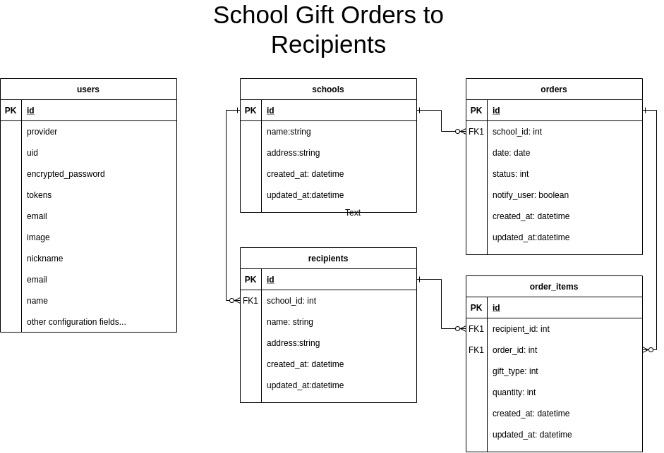

<h1 align="center">[Rails] Apptegy Technical Test / Apptegy API </h1>
<p>
  
  <a href="#" target="_blank">
    
  </a>
  <a href="https://twitter.com/ae_cordova" target="_blank">
    
  </a>
</p>

___
## Description of the project

The purpose of this project is to demonstrate knowledge and proficiency on Ruby on Rails framework by building a sample API app where authenticated USERS can ORDER GIFTS on behalf of a SCHOOL to designated RECIPIENTS. Orders can have multiple recipients and gifts at the same time, with a limit of 20 distinct recipients per order and 60 gifts per day.

<h3 align="center">Data Model Representation</h3>
<p align="center">
  
</p>


### ⭐️ Built with
* Ruby on Rails 6
* Postgres

### Dev Environment Requirements:
* Ruby needs to be installed to run the code, check [here](https://www.ruby-lang.org/en/documentation/installation/) for further steps
* Postgres DB needs to be setup locally to run the code, check docs [here](https://www.postgresql.org/docs/) for further guidance


### ⭐️ Running the code
#### Instructions for running on local environment:

1. Clone the repo

2. Navigate to the root directory

3. Run bundle install to ensure all the needed gems are installed:
    ```
    $ bundle install
    ```
3. Run Yarn Install
    ```
    $ yarn install --check-files
    ```
3. Migrate the DB
    ```
    $ rails db:migrate
    ```
3. Run Rails Server
    ```
    $ rails server
    ```
3. Create a User, send a request with at least email, password and password_confirmation fields in the body
    ```
    url:    https://localhost:3000/auth/

    header: Content-Type: application/json
    body:
            {
               "email": "test@email.com",
               "password": "password",
              "password_confirmation": "password"
            }
    ```
3. You will receive an :ok response with your credentials and token. Please send it in the headers for authentication in all future requests: you will need:
    ```
     - uid
     - access-token
     - client 
    ```

### ⭐️ How it works

These are the endpoints:

| Concerns/Constraints:  |   |
|---|---|
|Individual Orders are limited to a maximum of 20 Recipients|
|Schools are limited to send out a total of 60 gifts per day|
|There are four types of gift: MUG, T_SHIRT, HOODIE, STICKER.
|Orders have the following workflow status: ORDER_RECEIVED, ORDER_PROCESSING,ORDER_SHIPPED, ORDER_CANCELLED.|
|Orders can be sent to multiple Recipients and contain multiple gifts.|
|When an Order is marked to be ORDER_SHIPPED there's a flag on the order to determine whether to send the Recipient(s) an email message that their gift is on its way|
|All endpoints include an Auth Token in their requests|

| API EndPoints:  |   |
|---|---|
|Create a new User Token|   |
Verb              | POST
URI               | /auth(.:format)
Controller#Action | devise_token_auth/registrations#create
Request Params | email, password, password confirmation on body
Expected Response | status: 200 with credentials on Headers
|   |   |
|Create a new school record|   |
Verb              | POST
URI               | /api/v1/schools(.:format)
Controller#Action | api/v1/schools#create
Request Params | name, address on body
Expected Response | status: 201
|   |   |
|Update a school record|   |
Verb              | PATCH/PUT
URI               | /api/v1/schools/:id(.:format)
Controller#Action | api/v1/schools#update
Request Params | modified name or address on body
Expected Response | status: 202
|   |   |
|Delete a school record|   |
Verb              | DELETE
URI               | /api/v1/schools/:id(.:format)
Controller#Action | api/v1/schools#destroy
Request Params | school id on url
Expected Response | status: 202
|   |   |
|Create a new recipient record|   |
Verb              | POST
URI               | /api/v1/schools/:school_id/recipients(.:format)
Controller#Action | api/v1/recipients#create
Request Params | name, address on body
Expected Response | status: 201
|   |   |
|Update a recipient record|   |
Verb              | PATCH/PUT
URI               | /api/v1/recipients/:id(.:format)
Controller#Action | api/v1/recipients#update
Request Params | modified name or address on body
Expected Response | status: 202
|   |   |
|Delete a recipient record|   |
Verb              | DELETE
URI               | /api/v1/recipients/:id(.:format)
Controller#Action | api/v1/recipients#destroy
Request Params | recipient id on url
Expected Response | status: 202
|   |   |
|List all Recipients for a school|   |
Verb              | GET
URI               | /api/v1/schools/:school_id/recipients(.:format)
Controller#Action | api/v1/recipients#index
Request Params | school_id on url
Expected Response | status: 200, json object with recipient list
|   |   |
|Create a new order record for a school|   |
Verb              | POST
URI               | /api/v1/schools/:school_id/orders(.:format)
Controller#Action | api/v1/orders#create
Request Params | school_id on url, date on body
Expected Response | status: 201
|   |   |
|Update an order record|   |
Verb              | PATCH/PUT
URI               | /api/v1/orders/:id(.:format)
Controller#Action | api/v1/orders#update
Request Params | id on url, modified date or status on body
Expected Response | status: 202
|   |   |
|List all orders submitted for a given school|   |
Verb              | GET
URI               | /api/v1/schools/:school_id/orders(.:format)
Controller#Action | api/v1/orders#index
Request Params | school_id on url
Expected Response | status: 200, json object with order list
|   |   |
|Create an order item record for a given order|   |
Verb              | POST
URI               | /api/v1/orders/:order_id/items(.:format)
Controller#Action | api/v1/order_items#create
Request Params | order_id, recipient_id, gift_type(as described in Constraints), quantity(as described in Constraints) on body
Expected Response | status: 201
|   |   |
|Update an order_item record|   |
Verb              | PATCH/PUT
URI               | /api/v1/order_items/:id(.:format)
Controller#Action | api/v1/order_items#update
Request Params | modified attributes on body
Expected Response | status: 202
|   |   |
|Delete an order_item record|   |
Verb              | DELETE
URI               | /api/v1/order_items/:id(.:format)
Controller#Action | api/v1/order_items#destroy
Request Params | order_item id on url
Expected Response | status: 202
|   |   |
|List all order items for a given order|   |
Verb              | GET
URI               | /api/v1/orders/:order_id/items(.:format)
Controller#Action | api/v1/order_items#index
Request Params | order_id on url
Expected Response | status: 200, json object with order_item list

<!-- CONTRIBUTING -->
## Contributing

Any contributions you make are **greatly appreciated**.

1. Fork the Project
2. Create your Feature Branch (`git checkout -b feature/AmazingFeature`)
3. Commit your Changes (`git commit -m 'Add some AmazingFeature'`)
4. Push to the Branch (`git push origin feature/AmazingFeature`)
5. Open a Pull Request


## Authors

👤 **Angel Cordova** 
* Github: [@aecordova](https://github.com/https:\/\/github.com\/aecordova)  